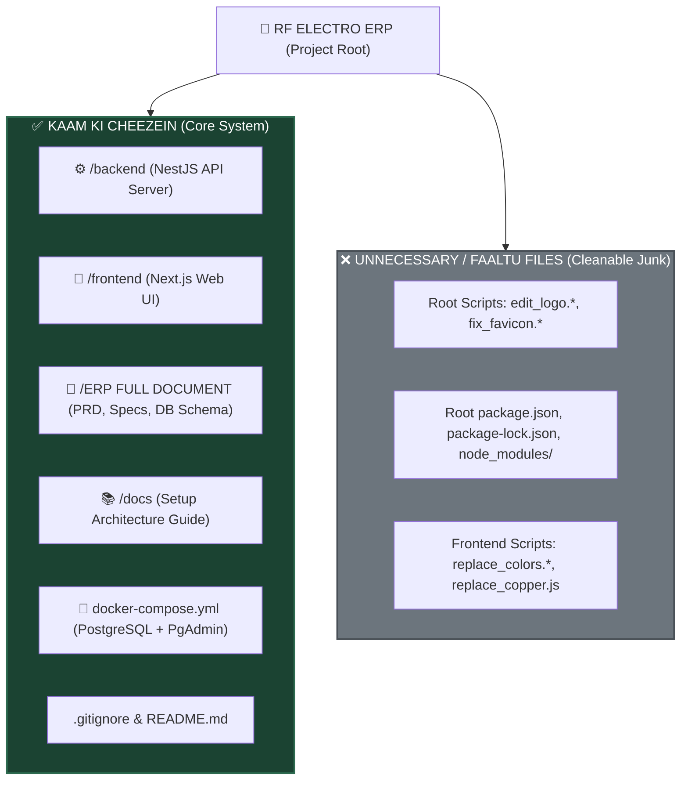

# 📁 RF ELECTRO ERP - Folder Structure & Cleanup Guide

Is document me **RF ELECTRO TECH ERP** project ka pura folder structure, konsi cheezein kaam ki hain, konsi cheezein faaltu (temporary/junk) hain, aur system ka poora architecture diagrams ke saath samjhaya gaya hai.

---

## 🛑 1. FAALTU / UNNECESSARY FILES (Jise aap Delete / Clean Kar Sakte Ho)

Yeh wo files hain jo development ke dauran testing, image editing ya batch replacement ke liye temporary script ke roop me banayi gayi thin. Inka main ERP app chalane se koi lena-dena nahi hai:

### A. Root Directory me Faaltu Scripts & Packages:
| File / Folder Name | Kya Hai? | Kyu Faaltu Hai? | Action |
| :--- | :--- | :--- | :--- |
| `edit_logo.js` | Image editing script | Logo edit karne ke liye temporary script thi. | 🗑️ Delete kar sakte ho |
| `edit_logo.py` | Python image script | Logo text edit karne ke liye use hui thi. | 🗑️ Delete kar sakte ho |
| `edit_logo_text.js` | Image editing script | Logo pe text add/edit karne ke liye script thi. | 🗑️ Delete kar sakte ho |
| `fix_favicon.js` | Favicon fix script | Favicon generate karne ka temporary code. | 🗑️ Delete kar sakte ho |
| `fix_favicon_2.js` | Favicon script v2 | Favicon generate karne ka temporary code. | 🗑️ Delete kar sakte ho |
| `fix_favicon_final.js` | Favicon final script | Favicon batch process ka script. | 🗑️ Delete kar sakte ho |
| Root `package.json` | Root Package config | Root me sirf `jimp` package installed hai (`npm i jimp` command se galti se root me ban gaya tha). Backend aur Frontend ke apne alag `package.json` hain. | 🗑️ Safe to delete |
| Root `package-lock.json` | Root Lockfile | Root node_modules ke liye auto-generated file. | 🗑️ Safe to delete |
| Root `node_modules/` | Root Dependencies | Disk space waste kar raha hai (jimp library ke liye). | 🗑️ Delete folder |

### B. Frontend Folder me Temporary Scripts:
| File Name | Kya Hai? | Kyu Faaltu Hai? | Action |
| :--- | :--- | :--- | :--- |
| `frontend/replace_colors.js` | Color replace script | UI me color codes badalne ke liye script. | 🗑️ Delete kar sakte ho |
| `frontend/replace_colors.py` | Python color script | Color replace script ka python version. | 🗑️ Delete kar sakte ho |
| `frontend/replace_copper.js` | Text replace script | Copper thickness text replacement script. | 🗑️ Delete kar sakte ho |
| `frontend/tsconfig.tsbuildinfo` | TypeScript Build Cache | Automatically auto-generate hota hai. | 🟢 Gitignore / Safe to delete |

---

## 📊 2. MERMAID GRAPH: Useful vs Unnecessary Files



---

## ⚡ 3. KAAM KI CHEEZEIN (Core Project Structure Breakdown)

Aapka project ek **Full-Stack PCB Manufacturing ERP System** hai. Iske 3 mukhya pillars hain:

```mermaid
graph LR
    User(("👤 User / Manager / QC / Client"))
    
    subgraph FrontendApp ["🎨 Frontend (Next.js App)"]
        AdminUI["(admin) Admin & Production Dashboard"]
        MobileUI["(mobile) Factory Operator & QC Mobile View"]
        ClientUI["portal / client-dashboard (Client Tracking)"]
    end

    subgraph BackendApp ["⚙️ Backend (NestJS Server)"]
        AuthMod["Auth & Users Module"]
        JobCardMod["Job Cards & Sub Job Cards"]
        ProcessMod["PCB Process Stages"]
        DispatchMod["Dispatches & Rejections"]
    end

    subgraph Database ["🗄️ Database Layer"]
        PrismaORM["Prisma ORM"]
        PostgresDB[("PostgreSQL Database")]
    end

    User --> FrontendApp
    FrontendApp -- "HTTP REST APIs" --> BackendApp
    BackendApp --> PrismaORM
    PrismaORM --> PostgresDB

    style FrontendApp fill:#0d6efd,color:#ffffff
    style BackendApp fill:#6610f2,color:#ffffff
    style Database fill:#198754,color:#ffffff
```



---

### Detailed Directory Structure & Purpose

### 1. ⚙️ `backend/` (NestJS REST API Engine)
Pura backend server **NestJS (TypeScript)** aur **Prisma ORM** par bana hai.

* 📁 `backend/src/main.ts` -> Backend ka entry point (Starts API server on port 5000/3001).
* 📁 `backend/src/app.module.ts` -> Main module jahan sare sub-modules register hote hain.
* 📁 `backend/src/modules/` -> ERP ke sare business features:
  * 🔑 `auth/` -> Login, Password Hash, JWT Auth, Guard & Roles.
  * 👤 `users/` -> Users Management (Admin, Operator, QC, Manager, Client).
  * 🤝 `customers/` -> Customer Master Database.
  * 📦 `customer-pos/` -> Customer Purchase Orders (POs).
  * 📋 `job-cards/` -> Main PCB Order Production Job Cards.
  * 🔬 `sub-job-cards/` -> Panel & Batch level sub-cards.
  * 🏭 `product-master/` -> PCB Specifications (Layer count, Copper thickness, Masking, etc.).
  * ⚙️ `process-stages/` -> PCB Factory Stages (Drilling, Plating, Etching, Solder Mask, Silk Screen, Final QC).
  * 🚚 `dispatches/` -> Shipping, Packing & Dispatch tracking.
  * ❌ `rejections/` -> Scrap, Defect & Rejection logs.
  * 📈 `reports/` -> Analytics & Production reports.
  * 🩺 `health/` -> Server status health check.
* 📁 `backend/prisma/` -> `schema.prisma` file me PostgreSQL Database ki 15+ Tables defined hain.
* 📁 `backend/.env` -> Database secret keys aur connection string (`DATABASE_URL`).

> ⚠️ **NOTE ON COMMAND FAILURE:**
> Backend directory me `npm run dev` nahi chalta kyunki script ka naam `"start:dev"` hai!
> Backend chalane ke liye: `npm run start:dev`

---

### 2. 🎨 `frontend/` (Next.js 14 UI Web Application)
Frontend **Next.js 14 App Router**, **React**, **Tailwind CSS**, aur **Lucide Icons** par bana hai.

* 📁 `frontend/src/app/` -> All Page Routes:
  * 🖥️ `(admin)/` -> Main ERP Management Dashboard (Orders, Job Cards, Workflows, Users, Reports).
  * 📱 `(mobile)/` -> Mobile-optimized Touch UI for Factory Floor Operators & QC Inspector.
  * 🌐 `portal/` & `client-dashboard/` -> Customer Portal (Clients can track order status).
  * 🔐 `(auth)/` -> Login & Password Reset screens.
* 📁 `frontend/src/components/` -> Reusable UI components (Tables, Modals, Navbars, Charts, Forms).
* 📁 `frontend/src/lib/` -> API calls utilities & Axios client configurations.
* 📁 `frontend/tailwind.config.ts` -> Custom ERP Color Theme & Styling setup.

> 🟢 **Command for Frontend:** `npm run dev` (Runs on http://localhost:3000)

---

### 3. 📄 `ERP FULL DOCUMENT/` & `docs/` (Blueprint & Documentation)
Yeh aapka **Master Project Blueprint** hai:
* `00_MASTER_CONTEXT.md` -> Project Overview.
* `01_PRD_PCB_ERP.md` -> Product Requirement Document.
* `02_TRD_Technical_Requirement.md` -> Technical Stack & Rules.
* `03_APP_FLOW.md` -> Complete Workflow of PCB Manufacturing.
* `05_DATABASE_SCHEMA.md` -> Complete DB Schema.
* `06_API_REQUIREMENTS.md` -> All REST API Enpoints specifications.
* `07_ROLE_PERMISSION_MATRIX.md` -> Permissions Matrix (Admin, QC, Operator, Manager).

---

## 🧹 4. ROOT CLEANUP COMMANDS (Kasra Hatao Command)

Aap PowerShell me ye commands chala kar root directory ke faaltu scripts aur extra `node_modules` ko safe tarike se delete kar sakte ho:

```powershell
# Root Directory me se Faaltu Files Remove karne ke liye:
Remove-Item -Path "edit_logo.js", "edit_logo.py", "edit_logo_text.js", "fix_favicon.js", "fix_favicon_2.js", "fix_favicon_final.js" -ErrorAction SilentlyContinue

# Root Directory me se Faaltu Package files remove karne ke liye:
Remove-Item -Path "package.json", "package-lock.json" -ErrorAction SilentlyContinue
Remove-Item -Recurse -Force -Path "node_modules" -ErrorAction SilentlyContinue

# Frontend me se Faaltu Scripts remove karne ke liye:
Remove-Item -Path "frontend/replace_colors.js", "frontend/replace_colors.py", "frontend/replace_copper.js" -ErrorAction SilentlyContinue
```

---

## 🚀 5. PROJECT PROPERLY RUN KARNE KA TARIKA

### Step 1: Start Backend (Terminal 1)
```powershell
cd "m:\RF ELECTRO ERP\backend"
npm run start:dev
```
*(Backend Server running on http://localhost:5000)*

### Step 2: Start Frontend (Terminal 2)
```powershell
cd "m:\RF ELECTRO ERP\frontend"
npm run dev
```
*(Frontend UI running on http://localhost:3000)*
